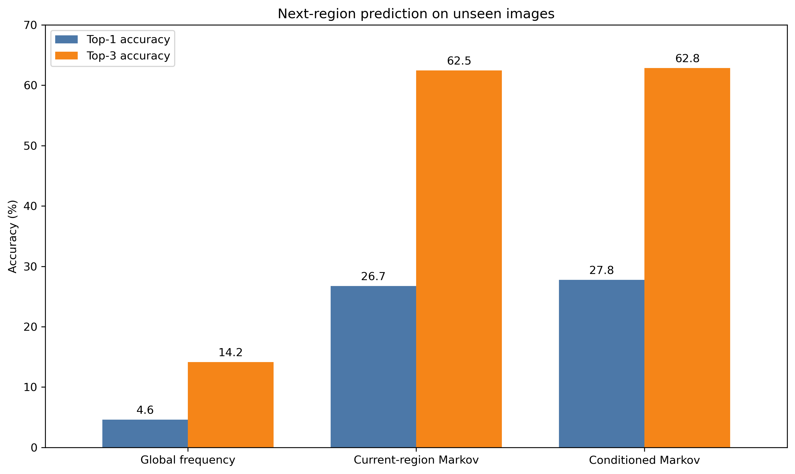
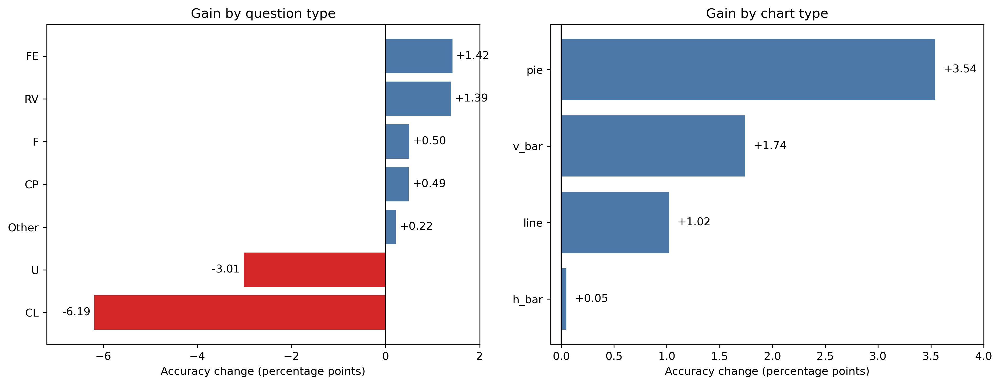
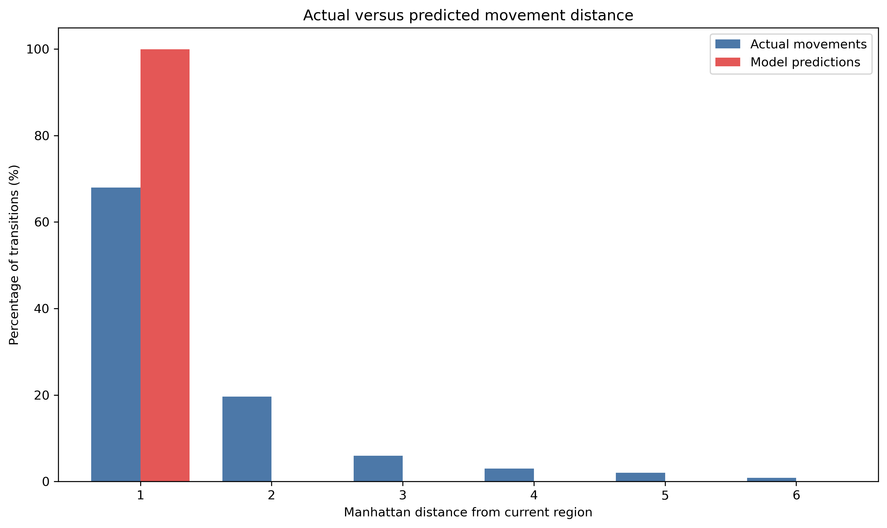

# Predicting Visual Attention Transitions in Charts

This project tests whether a simple sequential model can predict which chart region a viewer will inspect next while answering a question. It uses SalChartQA BubbleView mouse-click sequences as a scalable proxy for visual attention and evaluates every model on chart images excluded from training.

> BubbleView clicks are an attention proxy, not eye-tracker fixations. This project does not claim to reconstruct gaze scanpaths or provide a complete cognitive model of chart reading.

## Research question

How accurately can the next attended chart region be predicted from the current region, and how much additional information is provided by the viewer's question type and the chart type?

## Main findings

| Model | Top-1 accuracy | Top-3 accuracy |
|---|---:|---:|
| Global frequency | 4.62% | 14.16% |
| Current-region Markov | 26.74% | 62.47% |
| Fully conditioned Markov | 27.77% | 62.84% |

The current region contains most of the predictive signal. Adding question and chart context improves Top-1 accuracy by 1.03 percentage points over the current-region model. At image level, the mean gain is +1.31 percentage points, with a 95% bootstrap confidence interval of [0.90, 1.72].



## Data and preprocessing

- Source: SalChartQA question-driven chart-attention dataset.
- Charts: 3,000 images across horizontal bar, vertical bar, line, and pie charts.
- Responses retained after sequence cleaning: 73,829.
- Region-to-region transitions: 825,310.
- Representation: click coordinates normalized to chart dimensions and mapped to a 6 × 6 grid.
- Repeated consecutive clicks in the same grid cell are collapsed.
- Split: 2,400 training images and 600 unseen test images, stratified by chart type.

The split is performed by image rather than by transition. All responses for a chart remain in one partition, so no visual stimulus contributes transitions to both training and test data.

The original SalChartQA data are not redistributed in this repository. Obtain the data from the dataset authors and follow their usage conditions.

## Models

1. **Global frequency:** predicts the most frequent next region in training.
2. **Current-region Markov:** predicts the most frequent next region for each current region.
3. **Question-conditioned:** conditions on current region and question type.
4. **Chart-conditioned:** conditions on current region and chart type.
5. **Fully conditioned:** conditions on current region, question type, and chart type.

For unseen conditioning combinations, the model falls back to the current-region transition distribution.

## Ablation

| Feature set | Top-1 accuracy | Gain over current region |
|---|---:|---:|
| Current region | 26.74% | 0.00 pp |
| Current region + question type | 26.75% | +0.01 pp |
| Current region + chart type | 27.74% | +1.00 pp |
| Current region + question type + chart type | 27.77% | +1.03 pp |

Chart type accounts for almost all of the aggregate improvement. The gain is largest for pie charts (+3.54 pp), followed by vertical bar charts (+1.74 pp) and line charts (+1.02 pp). Horizontal bars show almost no change (+0.05 pp).



## Image-level robustness

Across the 600 test images, mean per-image accuracy increases from 24.91% to 26.22%, while the median increases from 25.37% to 26.81%. The conditioned model improves 357 images, leaves 25 unchanged, and worsens 218.

## Failure analysis

The model strongly overpredicts local movement. Actual movements have Manhattan distance one in 67.98% of transitions, whereas 99.90% of model predictions have distance one. Accuracy is 40.83% for true distance-one movements and approximately zero for longer jumps. The baseline therefore captures spatial continuity but not long-range or semantically directed attention shifts.



## Repository structure

```text
.
├── figures/     # Main result figures
├── notebooks/   # Executed notebook and HTML export
├── report/      # Public project report
├── results/     # Summary tables and fixed train/test image lists
├── .gitignore
├── README.md
└── requirements.txt
```

The complete public report is available at [`report/Jingjing_Zhi_SalChartQA_Attention_Transitions.pdf`](report/Jingjing_Zhi_SalChartQA_Attention_Transitions.pdf).

## Reproducing the analysis

1. Use Python 3.10 or newer.
2. Create and activate a virtual environment.
3. Install the dependencies:

   ```bash
   pip install -r requirements.txt
   ```

4. Obtain SalChartQA from the dataset authors and keep it outside this repository.
5. Open `notebooks/SalChartQA_attention_transitions.ipynb`.
6. Set the notebook's data-root variable to the local SalChartQA directory.
7. Restart the kernel and run all cells from top to bottom.

The HTML export allows the complete executed analysis to be inspected without running the notebook.

## Limitations

- BubbleView clicking introduces a deliberate motor action and may omit covert or brief inspection.
- A 6 × 6 grid ignores semantic chart elements, labels, axes, and relationships.
- A first-order Markov model cannot represent longer histories, revisits, or task progress.
- The evaluation holds out images, not participants.
- Transition-level accuracy is dominated by common local movements; per-image uncertainty and distance analysis reduce but do not remove this imbalance.

## Next steps

- Replace grid cells with semantic chart elements detected from chart structure and text.
- Model longer histories with variable-order Markov models, recurrent architectures, or transformers.
- Separate participant, image, chart-type, and question effects with hierarchical evaluation.
- Compare supervised sequence prediction with computational-rationality or reinforcement-learning models.
- Build an interactive visual-analytics interface for trajectories, uncertainty, subgroup differences, and failures.

## Dataset citation

Wang, Y., Wang, W., Abdelhafez, A., Elfares, M., Hu, Z., Bace, M., and Bulling, A. (2024). *SalChartQA: Question-driven Saliency on Information Visualisations*. Proceedings of the 2024 CHI Conference on Human Factors in Computing Systems. https://doi.org/10.1145/3613904.3642942

## Author

Jingjing Zhi  
GitHub: https://github.com/joyce-zhi

